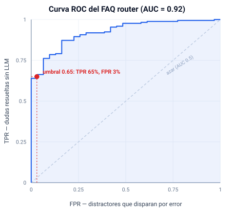

# Bot de WhatsApp de seguros: decisiones de producto

**Caso de estudio.** Diseño de un asistente de WhatsApp para seguros, tomando como
referencia la oferta pública de La Caja. Este documento explica cada decisión de
producto, el criterio que la sustenta y el dato que la respalda. Sirve de base
para una entrada de blog.

> **Alcance y transparencia.** Es un análisis independiente hecho con información
> pública del sitio de La Caja (relevada en julio de 2026). No estoy afiliado a
> la empresa ni tuve acceso a datos internos. Las conjeturas sobre el funnel están
> marcadas como hipótesis, separadas de los hechos observados. El producto es un
> prototipo funcional, no un sistema en producción.

---

## 1. Objetivo

Construir un asistente de WhatsApp que ayude a una persona a **entender, comparar
y cotizar** un seguro, y evaluar si ese canal cubre una necesidad que hoy no está
bien atendida. El foco del ejercicio no es la proeza técnica, sino el **juicio de
producto**: dónde jugar, por qué, y cómo se mediría el éxito.

## 2. Metodología

1. Relevamiento del sitio público de La Caja (home, páginas de producto, centro
   de preguntas frecuentes).
2. Mapeo del catálogo, las coberturas por línea y los canales de atención.
3. Identificación de qué resuelve hoy cada canal (web, app, WhatsApp, telefónico).
4. Definición del hueco de producto y de las decisiones que se derivan de él.

## 3. Hallazgos del benchmark (hechos observados)

**Catálogo amplio para personas:** Auto, Moto, Hogar, Salud, Bicicleta/Monopatín,
Notebook/Tablet, Cartera, Vida, Accidentes Personales, Cuidados Mayores, Auto
Conectado. Para empresas, Flota y otras soluciones.

**Ya existe un bot de WhatsApp: "Letizia" (11-4857-7777).** En el propio sitio,
Letizia aparece como el primer canal recomendado para: modificar la póliza, darse
de baja, descargar documentación y hacer consultas. Es decir, está posicionado
para **posventa y autogestión de clientes existentes**.

**La cotización vive en la web,** en cotizadores separados por línea
(cotizador.lacaja.com.ar/seguro-auto, hogar.lacaja.com.ar, moto.lacaja.com.ar),
con un flujo de 4 pasos (datos, cotizar, forma de pago, listo).

**Estructura de producto clara y escalonada.** Ejemplo en Auto: Terceros Completo,
Terceros Completo con Granizo, Todo Riesgo con Franquicia. En Moto: Responsabilidad
Civil, Total B, Total A. Es una lógica de "bueno / mejor / óptimo" fácil de
explicar en una conversación.

**Canales digitales maduros:** app, Portal Personas, Centro de Operaciones Online,
telemedicina 24hs por WhatsApp, botón de arrepentimiento (10 días).

## 4. El insight de producto

Los dos extremos del recorrido del cliente están cubiertos, pero hay un hueco en
el medio:

| Etapa del funnel | Canal actual | Experiencia |
|---|---|---|
| Descubrir / entender qué me conviene | (sin dueño claro) | El usuario compara solo |
| Cotizar | Cotizador web | Formulario, requiere salir a la web |
| Contratar | Web / asesor | |
| Usar y gestionar (posventa) | Letizia (WhatsApp) + app | Bien resuelto |

**Hipótesis de producto:** la etapa de **venta asesorada** (ayudar a alguien que
todavía no sabe qué plan le conviene, comparar coberturas y cotizar sin fricción)
no tiene un dueño conversacional. WhatsApp, que la empresa ya usa con éxito para
posventa, es el canal natural para ocuparla.

Esta es la apuesta central: **no duplicar a Letizia, sino cubrir la pre-venta.**

## 5. Decisiones de producto

Cada decisión sigue el mismo formato: qué decidí, con qué criterio, respaldada por
qué dato, y qué resigné.

### Decisión 1: posicionar el bot en venta asesorada, no en autogestión

- **Criterio:** no competir donde el incumbente ya es fuerte; buscar el espacio
  vacío de mayor valor.
- **Dato que la respalda:** Letizia ya resuelve la posventa; la cotización está en
  la web y no en el chat.
- **Por qué:** clonar Letizia sería esfuerzo sin diferencial. La pre-venta
  conversacional ataca el momento de mayor intención de compra y menor
  acompañamiento.
- **Trade-off:** la venta asesorada exige más lógica de negocio (comparar,
  recomendar) que responder preguntas de autogestión.

### Decisión 2: WhatsApp como canal principal

- **Criterio:** encontrarse con el usuario donde ya está y donde la empresa ya
  demostró tracción.
- **Dato que la respalda:** La Caja ya invierte en WhatsApp (Letizia, telemedicina
  por WhatsApp). El canal está validado internamente.
- **Por qué:** menor fricción que un formulario web; permite conversación,
  seguimiento y captura de lead en el mismo lugar.
- **Trade-off:** WhatsApp impone límites de formato (texto, sin tablas ricas) y
  reglas de la plataforma (ventanas de mensajería, plantillas).

### Decisión 3: motor híbrido (menús + IA), no uno u otro

- **Criterio:** usar la herramienta adecuada para cada tipo de tarea.
- **Dato que la respalda:** el proceso de cotización es estructurado y repetible
  (los cotizadores web ya lo modelan en 4 pasos), mientras que las dudas ("¿qué es
  la franquicia?", "¿cubre granizo?") son abiertas.
- **Por qué:** los menús dan control, previsibilidad y bajo costo en el flujo de
  cotización; el modelo de lenguaje da flexibilidad en las consultas abiertas,
  anclado a contenido real para no inventar.
- **Trade-off:** dos caminos que mantener y una frontera (cuándo usar cada uno)
  que hay que afinar.

### Decisión 4: empezar por Auto

- **Criterio:** priorizar por volumen y claridad de la estructura de planes.
- **Dato que la respalda:** Auto es la línea más destacada del sitio (campañas,
  cotizador propio) y tiene una escalera de 3 planes muy explicable.
- **Por qué:** maximiza aprendizaje por unidad de esfuerzo y permite validar el
  flujo completo antes de replicarlo.
- **Trade-off:** deja fuera, al inicio, líneas con lógica distinta (Salud es un
  seguro de enfermedades graves, no de daños).

### Decisión 5: comparar planes dentro del chat

- **Criterio:** reducir la carga cognitiva de la decisión.
- **Dato que la respalda:** la estructura "bueno / mejor / óptimo" de La Caja se
  presta a una comparación de 3 opciones, que es un número manejable en una
  conversación.
- **Por qué:** ayudar a elegir es justamente el valor que falta en la etapa de
  pre-venta.
- **Trade-off:** simplificar coberturas para el chat puede perder matices; hay que
  cuidar que la síntesis sea fiel.

### Decisión 6: capa de adaptadores de mensajería (proveedor intercambiable)

- **Criterio:** separar la lógica de negocio del canal para no quedar atado a una
  decisión de infraestructura temprana.
- **Dato que la respalda:** existen varias vías para WhatsApp (API oficial de Meta,
  Twilio, librerías no oficiales) con distintos costos y riesgos.
- **Por qué:** permite desarrollar y probar el producto con un adaptador de
  consola (sin credenciales), y enchufar la API oficial de Meta cambiando una
  variable. Acelera el time-to-market y reduce el riesgo de re-trabajo.
- **Trade-off:** una capa de abstracción más; se justifica por la incertidumbre
  sobre el proveedor final.

### Decisión 7: base de conocimiento con contenido real, no genérico

- **Criterio:** la credibilidad del asistente depende de la fidelidad de la
  información.
- **Dato que la respalda:** las respuestas del modelo se anclan al contenido
  relevado (planes, franquicia con ejemplo, requisitos de hogar, condiciones de
  Salud), no a conocimiento inventado.
- **Por qué:** en seguros, una respuesta incorrecta sobre una cobertura es un
  riesgo real; anclar a fuente reduce las alucinaciones.
- **Trade-off:** el contenido hay que mantenerlo actualizado cuando cambian los
  productos.

### Decisión 8: comunicar el análisis como caso de estudio público

- **Criterio:** un buen análisis que nadie lee no cambia nada; la distribución es
  parte del producto.
- **Dato que la respalda:** el público objetivo (equipos de producto, en
  particular La Caja) consume casos de estudio en formato blog, no repositorios de
  código.
- **Por qué:** publicar el razonamiento como entrada de blog (fuente: este mismo
  documento) traduce el trabajo a un formato que llega al lector correcto.
- **Trade-off:** exponer el análisis públicamente; se asume porque el objetivo es,
  justamente, que se lea.

### Decisión 9: cuánto pedir en la cotización de auto

- **Criterio:** en pre-venta, cada campo extra cuesta conversión. Capturar el
  mínimo que hace al lead accionable y diferir lo sensible al asesor.
- **Dato que la respalda:** relevando el cotizador web real de La Caja
  (cotizador.lacaja.com.ar), el primer paso pide del auto año, marca, modelo,
  versión y GNC. Pero antes de mostrar un solo precio exige **e-mail y teléfono
  de contacto** (más CP y localidad) y un reCAPTCHA. Es decir: **la web te obliga
  a entregar tu contacto para ver un número**. Los datos más sensibles (DNI, etc.)
  llegan después, en el paso "Datos personales".
- **El contraste que explota el bot:** ese muro de contacto es fricción pura en
  pre-venta. El bot no lo necesita: **ya tiene el WhatsApp del usuario**, así que
  puede dar una orientación de precio sin pedir e-mail ni teléfono de nuevo. Menos
  campos, misma capacidad de que un asesor recontacte.
- **Por qué (la elección):** el bot replica los campos del vehículo del form real
  (año, marca, modelo, versión, GNC), **estructurados** en vez de texto libre,
  porque un lead detallado es el valor de la venta asesorada y le da al asesor
  algo accionable. Pero **no** pide edad/DNI: es PII invasiva y temprana en el
  funnel, y el bot ya tiene el WhatsApp del usuario; eso lo recolecta el asesor,
  que es el lugar natural para lo sensible.
- **Softeners** (bajan fricción sin perder dato): la **versión es salteable**
  ("no sé", como en la web, donde mucha gente no la tiene a mano).
- **Iteración (0km vs usado):** al principio lo **derivé del año** (si el año era
  el actual, 0km; si no, usado) para ahorrar una pregunta. Probándolo en WhatsApp
  real apareció el error: un modelo de años anteriores **también puede ser 0km** si
  es stock del concesionario sin patentar, y la condición no es cosmética (define
  si hace falta inspección: el 0km no inspecciona, el usado carga fotos online).
  Adivinarla mal le da al asesor un dato falso y al usuario una instrucción
  equivocada. Lección: **no derivar un dato de negocio de un proxy frágil**; una
  pregunta binaria corta ("0km o usado") es barata y correcta. Se pasó a pedirla
  explícita.
- **Trade-off:** más pasos que un flujo mínimo, con más drop-off potencial, a
  cambio de un lead mucho más rico y correcto. Se mitiga con preguntas cortas y el
  softener de versión, y se mide con el drop-off por paso (sección 6).

### Decisión 10: precio orientativo con un motor de factores, no scraping

- **Criterio:** dar una orientación de precio dentro del chat (que es lo que la
  persona quiere saber) sin prometer un número en firme, y modelarlo como lo hace
  una aseguradora: por factores de riesgo.
- **Opciones que evalué:**
  - *Rango fijo local:* simple, pero no enseña nada del negocio.
  - *Scraping del cotizador web:* trae el número real, pero es frágil (rompe si
    cambian el form), lento, con riesgo de ToS, y no explica el mecanismo. Encima,
    scrapear el sitio de La Caja para después mostrarle el proyecto a La Caja es
    exactamente el gesto que no quiero hacer.
  - *Mock del tarifador (elegida):* un modelo de factores que replica cómo se
    arma una prima.
- **Por qué (la elección):** una aseguradora no "mira su web", corre un
  **tarifador** que compone la prima con factores de riesgo (base por plan,
  antigüedad, condición 0km/usado, zona por CP, GNC). Modelé eso como una función
  de dominio pura y determinística, y devuelvo un **rango** ("desde X hasta Y por
  mes"), no un valor puntual, para no simular una cotización en firme.
- **La costura de integración:** el modelo vive detrás de un puerto
  `QuotingProvider`. Hoy lo implementa un adapter local; mañana la **API del
  tarifador real de La Caja** entra en el mismo puerto sin tocar el dominio ni el
  flujo. Eso es lo que un equipo de La Caja reconoce: no adiviné un número ni copié
  la web, dejé el lugar donde enchufa su rating engine.
- **Evidencia del cotizador real (relevado a mano):**
  - El paso a precio está **protegido por reCAPTCHA**: La Caja bloquea bots de
    forma explícita, así que scrapear no solo es frágil, es ir contra una barrera
    puesta a propósito. Confirma la elección de no scrapear.
  - El precio **depende de CP y localidad** (el form los pide antes de cotizar):
    valida el `factorZona(cp)` del modelo, la tarifación por ubicación es real.
  - La promo vigente descuenta por antigüedad ("30% hasta 5 años, 20% hasta 15"):
    la antigüedad mueve el precio, en línea con el `factorAntiguedad`.
  - El cotizador es **frágil**: falló el cálculo cada vez que lo intenté (3 de 3,
    "Algo salió mal") y, al fallar, **deriva a WhatsApp** (11-4857-7777). Refuerza la
    tesis del proyecto: WhatsApp como canal resiliente cuando el funnel web se cae.
- **Trade-off:** los valores de los factores son ilustrativos, así que el número es
  orientativo. Se mitiga siendo explícito en el chat ("rango orientativo, el asesor
  confirma el final") y dejando los factores tuneables y aislados para calibrarlos
  con datos reales.
- **Anclaje real (logrado):** el cotizador de **auto** falló varias veces (backend
  intermitente), pero al reintentar devolvió los tres precios de un mismo caso
  (Toyota Corolla 2020, usado, sin GNC, CABA): Terceros Completo $160.165, con
  Granizo $202.443, Todo Riesgo $247.847 por mes. Con eso **anclé el tarifador de
  auto** (estaba ~7× bajo). El precio real escala con el **valor del auto** (la suma
  asegurada, ~$27M en este caso, que la web deriva de año/marca/modelo); esa
  dependencia, que al principio el modelo no capturaba, se resolvió **derivando** el
  valor de modelo/año en vez de preguntarlo (ver Decisión 15).
- **Anclaje real (hogar):** el cotizador de **hogar sí devolvió precios** de arranque.
  Relevé dos puntos del mismo caso (168M de incendio → $11.760/mes, 252M →
  $16.683/mes) y con esa regresión **calibré el tarifador de hogar** (tasa
  ~0,0051%/mes, cargo fijo ~$1.665, costo de reconstrucción ~$2,1M/m²). El modelo
  reproduce ambos precios reales. Ver Decisión 12.

### Decisión 11: conectar el bot donde ya se gasta la plata (el embudo pago)

- **Criterio:** el bot no vale por existir, vale por dónde se enchufa. El lugar de
  mayor impacto es donde la conversión ya se está pagando y perdiendo.
- **Dato que la respalda (relevado en vivo):** entré por un aviso de Google Ads al
  landing "Elegí el mejor seguro" de La Caja (con teléfono de campaña propio, o sea
  tráfico pago). El análisis del embudo:
  - El aviso pago aterriza en un **hub de seis productos + un carrusel**, no en una
    intención única: sin coincidencia de mensaje ni CTA único, la persona tiene que
    volver a elegir.
  - Todos los CTA de auto caen en el **mismo cotizador que falló (3 de 3)** y que
    exige e-mail + teléfono + reCAPTCHA antes de mostrar precio: se paga adquisición
    para estrellarla contra un backend caído y de alta fricción.
  - **No hay canal de baja fricción** en el landing pago (ni WhatsApp, ni cotización
    express, ni formulario corto), a diferencia del sitio institucional que sí tiene
    botón de WhatsApp.
- **Por qué (la elección):** posiciono el bot como la **capa de captura sobre el
  tráfico pago**. Un CTA "Cotizá por WhatsApp" en ese landing da una sola acción de
  baja fricción, captura el lead en el canal (sin repetir el muro de contacto) y
  sigue en pie cuando el cotizador web se cae. Convierte clics pagos en
  conversaciones en vez de perderlos.
- **Trade-off:** medir la atribución (qué lead vino del bot vs del cotizador) exige
  instrumentar bien el origen; se cubre con los eventos del funnel (sección 6) y un
  parámetro de origen en el link del CTA.

### Decisión 12: sumar hogar mapeando un producto personalizable a un flujo simple

- **Criterio:** una segunda línea prueba que el bot escala a más productos sin
  reescribir el núcleo, y obliga a resolver cómo se modela un producto que no tiene
  niveles fijos.
- **Dato que la respalda (cotizador real de hogar):** el primer paso pregunta
  **propietario o inquilino** (define si se asegura el edificio o solo el
  contenido). Recorriendo el paso "Datos del hogar" con propietario aparecen los
  campos reales: **tipo de hogar** (casa / departamento / departamento en PB o PH),
  **vivo en barrio privado**, **tipo de uso** (permanente / temporal / alquilo),
  **m² construidos** (25-300), CP y una atestación de seguridad. El paso 2 es
  **"Personalizá tu plan"** (no hay tres tiers como en auto, la variable central es
  la suma asegurada), y el plan **incluye asistencias** concretas (mascota,
  plomería/electricidad/cerrajería/gasista, alimentos por corte de luz,
  mudanza/limpieza).
- **Por qué (el flujo, y qué resigné):** capturo propietario/inquilino → tipo de
  hogar (3 opciones) → uso → **m² (solo a propietario)** → CP → **suma del
  contenido**, y devuelvo la estimación con las asistencias reales. Prioricé por
  señal sobre fricción:
  - **Sumé los m²**: eran el gran faltante, definen la suma del *edificio*. Los pido
    **solo a propietario** (el inquilino no asegura el edificio): fidelidad sin
    fricción de más.
  - **Sumé uso y tipo de hogar a 3 opciones**: factores reales de una sola pregunta
    (una vivienda vacía o en PB tiene más riesgo).
  - **Diferí barrio privado/country** (buen modificador de robo, pero para no estirar
    el flujo queda como factor futuro) y dejé la **atestación de seguridad implícita**
    (como el "buen estado" de auto).
  - No invento tiers que La Caja no vende: el "plan" es el producto y la variable es
    la suma.
- **Calibrado con datos reales (a diferencia de auto):** el cotizador de hogar sí
  devolvió precios. Relevé dos puntos del mismo caso (168M → $11.760/mes, 252M →
  $16.683/mes) y con la regresión ajusté el tarifador para que **reproduzca ambos**.
  De ahí también adopté su **estructura**: el propietario **deriva la suma de
  incendio de los m²** (a ~$2,1M/m²) en vez de que le pregunte el contenido, como
  hace la web; el inquilino, que no asegura el edificio, sí da su contenido. La prima
  es una tasa sobre esa suma más un cargo fijo (RC + cristales + asistencias).
- **La zona es específica por producto (hallazgo):** coticé el mismo caso en CABA y
  salió **~2% más barato** que en el interior. Es lo **opuesto a auto**, donde CABA
  es mucho más cara por robo. En hogar el riesgo (incendio, edificio) no está
  dominado por el robo, así que la zona es casi plana. Reutilizar el `factorZona` de
  auto era un error: agregué un `factorZonaHogar` propio (CABA 0,98, resto 1,0). El
  worksheet `casos-cotizacion-hogar.md` enumera las combinaciones para seguir
  relevando y afinando.
- **El uso no es un multiplicador de riesgo, es un bundle de cobertura (hallazgo):**
  coticé el mismo caso "permanente" (habitada por el dueño) y salió **$22.062/mes**,
  casi el **doble** que "alquilada" ($11.502). El motivo no es riesgo: cuando vivís
  ahí, el plan **suma tu contenido** (robo, TV/audio, mayor suma de incendio); cuando
  la alquilás, cubre **solo el edificio**. Mi factor estaba **al revés** (asumía que
  alquilar era más caro). Lo corregí y anclé: alquilo 1,0 (base), permanente 1,91
  (dato real), temporal ~2,0 (ilustrativo). Lección de producto: no asumir la
  dirección de un factor sin el dato; a veces la variable cambia *qué* se cubre, no
  solo cuánto se cobra.
- **Una casa cuesta más porque se reconstruye más cara (hallazgo):** coticé el mismo
  caso como casa y salió **$13.665** vs **$11.502** depto (ratio ~1,19). La suma de
  incendio de la casa fue mayor (193M vs 168M): se reconstruye a ~$2,4M/m² contra
  ~$2,1M del depto, porque tiene **estructura propia** (techo, cimientos) y no la
  comparte con un edificio. No es solo riesgo. Ajusté `factorTipoHogar(casa)` a 1,19
  (dato real). Con esto, **todos los factores del hogar quedan anclados** salvo PB/PH.
- **Por qué (la arquitectura, lo que demuestra el ejercicio):** el lead pasó a ser
  una **unión discriminada** (`AutoLead | HogarLead` por `producto`), el tarifador
  ganó un `estimarPrimaHogar` en el dominio y un `quoteHogar` en el puerto
  `QuotingProvider`, y Postgres pasó a columnas comunes + `detalle` jsonb. Sumar un
  producto tocó bordes acotados, no el motor: eso es lo que compra la arquitectura
  hexagonal.
- **Trade-off:** nivel, zona, uso y tipo de hogar (casa vs depto) ya están anclados
  a precios reales; quedan ilustrativos solo **PB/PH** y **temporal**, que necesitan
  cotizar el mismo caso variando esas dimensiones (el
  worksheet ya deja esas filas listas para completar).

### Decisión 13: sumar accidentes personales, un tercer shape de producto

- **Criterio:** una tercera línea de forma distinta prueba que el bot no está atado
  a un modelo de pricing, sino que se adapta al del producto real.
- **Dato que la respalda:** el sitio de La Caja muestra Accidentes Personales como
  un **catálogo de planes fijos con precio publicado**, en tres modalidades
  (Protección Familiar, Trabajo Independiente, Personal Doméstico). No hay
  cotizador ni factores: el precio está listado (ej. Familiar Plan A $9.124, Plan B
  $14.176; Personal Doméstico $5.500). Asistencias iguales en todos (telemedicina,
  cobertura familiar, ambulancia, consulta a domicilio).
- **Por qué (los tres shapes):** cada producto tiene su modelo de precio y el bot
  lo respeta:
  - **Auto:** atributos del vehículo → estimación por factores (rango).
  - **Hogar:** atributos → estimación por factores anclada a precios reales.
  - **Accidentes:** **catálogo → precio publicado exacto** (sin estimación).
  El flujo de AP es elegir modalidad y plan; el precio sale de un catálogo de
  dominio, no de un tarifador. Que las tres formas convivan en el mismo motor de
  conversación y la misma unión de leads es la prueba de que la arquitectura no
  asumió un único tipo de producto.
- **Trade-off:** el catálogo hay que mantenerlo cuando La Caja cambie precios o
  planes; se aísla en `session.ts` (una sola fuente) para que sea un cambio de dato,
  no de lógica.

### Decisión 14: bici/monopatín, un cuarto shape (precio por valor declarado)

- **Criterio:** una cuarta línea con otra forma de precio confirma que el patrón
  no era casualidad: el bot lee el modelo de cada producto.
- **Dato que la respalda:** el cotizador de bici muestra tres tarifas por **suma
  asegurada** (el valor del rodado): $370.800 → $6.894, $539.400 → $9.959,
  $1.012.000 → $18.549. La tasa es muy consistente, **~1,85% mensual sobre el
  valor**.
- **Por qué (la mejora sobre la web):** en vez de ofrecer tres tiers fijos, el bot
  pregunta **cuánto vale tu rodado** y estima al 1,85% real. Es un **cuarto shape**:
  precio por **valor declarado** (un solo factor), anclado a datos y personalizado
  al rodado del usuario, no a tres cajas.
- **Los cuatro shapes conviviendo:** auto (multi-factor), hogar (multi-factor
  anclado), accidentes (catálogo fijo), bici (**tasa sobre valor**). Cuatro modelos
  de precio en el mismo motor de conversación y la misma unión de leads. Esa es la
  tesis del ejercicio hecha evidencia: la arquitectura no asumió cómo se cobra un
  seguro, se adapta a cada uno.
- **Trade-off:** modelar por valor declarado extrapola fuera del rango de las tres
  tarifas relevadas; el número es orientativo y el asesor confirma la cuota final.

### Decisión 15: capturar el valor del auto sin preguntarlo (derivar, no preguntar)

- **Criterio:** la métrica es conversión y minimizar abandono, así que cada pregunta
  extra es fricción a evitar. Mejor relación UX/info: sacar el máximo dato de lo que
  ya se pregunta.
- **El problema:** el precio de auto **escala con el valor asegurado** del vehículo
  (el quote real dio ~0,6-0,9% de $27,3M según plan), y el modelo no lo capturaba:
  estimaba igual para un Gol que para una Hilux.
- **Opciones y por qué (trade-off):**
  - *Preguntar el valor:* "¿cuánto vale tu auto?" es una pregunta que **mucha gente
    no sabe responder**; o abandona o adivina. Es un punto clásico de drop-off, y La
    Caja **nunca la pregunta**.
  - *Derivar de una tabla (elegida):* el valor sale de **marca/modelo/año**, datos
    que el flujo **ya pide** para el lead. Cero preguntas nuevas, cero fricción, y es
    exactamente cómo lo hace el cotizador real (deriva de una guía de valores tipo
    Infoauto).
- **La elección:** el tarifador de auto pasó a `prima = valorAsegurado(modelo, año)
  × tasa_por_plan × zona × GNC`. La tabla de valores es ilustrativa (sembrada con el
  valor real del Corolla y una curva de depreciación) y vive detrás del mismo puerto:
  mañana se enchufa la guía real. Con esto el Gol cotiza más barato que la Hilux, sin
  sumar una sola pregunta.
- **Trade-off:** hay que mantener la tabla de valores; se aísla en un solo lugar para
  reemplazarla por la guía real de un plumazo.

### Decisión 16: una demo web app para que cualquiera pruebe el bot

- **Criterio:** la métrica es conversión y bajar fricción, y eso también aplica a la
  fricción de **probar** el bot. El mayor freno para que un evaluador (en particular,
  alguien de La Caja) lo pruebe era el acceso: WhatsApp Cloud API solo responde a
  números en una lista blanca, y depender de un túnel local (ngrok) ata la demo a que
  yo tenga la máquina prendida. Nadie debería pedir permiso ni instalar nada para ver
  el bot funcionando.
- **La decisión:** exponer el **mismo motor** por un segundo canal, una **web app** de
  chat con estética de WhatsApp, servida como una página autocontenida más un endpoint
  `POST /chat`. Es la misma conversación (menús, cotización, IA); solo cambia el
  transporte. Y se desplegó a un hosting con una URL pública y estable, así el link se
  comparte y listo.
- **Por qué se pudo sin tocar el núcleo:** es la Decisión 6 pagando de nuevo. El canal
  es un borde; el motor de conversación ya estaba desacoplado del transporte, así que
  sumar el canal web fue una ruta HTTP nueva, no un rediseño.
- **Trade-off:** un segundo canal para mantener y una superficie web pública (con su
  aclaración de que es una demo con datos públicos, no un canal oficial). A cambio,
  cualquiera prueba el bot en un clic, que es justo lo que una demo necesita.

### Decisión 17: resolver las dudas repetidas sin llamar al LLM (router semántico)

- **Criterio:** el costo por conversación importa, y la mayoría de las consultas
  abiertas son las mismas pocas dudas (qué cubre tal plan, qué es la franquicia, cómo
  pago). Pagar una generación de LLM por cada repetición es tirar plata; pero responder
  mal una duda de seguros es peor que gastar de más.
- **La decisión:** antes de la generación, la consulta pasa por un **router semántico**.
  Al arrancar se embeden (OpenAI `text-embedding-3-small`) las 35 dudas del benchmark con
  sus variantes (172 formulaciones); cada consulta se compara por **similitud coseno**
  contra ese corpus, y si el mejor match supera un umbral, se devuelve la **respuesta
  canónica sin llamar al LLM**. Si no, cae al asistente como siempre.
- **Por qué se pudo sin tocar el núcleo:** de nuevo la Decisión 6. Entraron dos puertos
  nuevos (un proveedor de embeddings y un matcher de FAQ) detrás de la misma interfaz de
  dependencias; el motor solo sabe "¿hay respuesta canónica? sí o no". El coseno es
  lógica pura en el dominio; el proveedor de embeddings es un borde intercambiable
  (mañana, otro modelo o un vector store).
- **Evaluación (por qué 0.65 y no a ojo):** elegir el umbral es un problema de
  clasificación binaria (¿esta consulta tiene respuesta canónica?), así que se mide con
  una **curva ROC**. Con método leave-one-out (cada formulación se busca contra el corpus
  menos sí misma) sobre 172 formulaciones como positivos y 31 distractores como negativos
  (fuera de tema y adyacentes a seguros sin cubrir: lanchas, mala praxis, caución), el
  **AUC da 0.92**: el coseno separa muy bien lo conocido de lo desconocido.

  

  El punto de operación elegido, **0.65**, cae en el codo de la curva: **65% de
  cobertura** (dudas resueltas sin LLM) con **3% de falsos positivos** (1 de 31 negativos
  difíciles se filtra) y **96% de acierto de contenido**. Subir a 0.70 da **cero falsos
  positivos** a costa de bajar la cobertura a 53%; bajar a 0.60 dispara los falsos
  positivos a 16%. Se operó en 0.65 privilegiando cobertura, con el LLM de red de
  seguridad para todo lo que no supera el umbral. Reproducir: `pnpm eval:faq`.
- **Trade-off:** una llamada de embedding por consulta abierta (fracción de centavo) y un
  benchmark que mantener. A cambio, las dudas repetidas se resuelven a costo casi cero,
  con respuesta determinista y sin latencia de generación. El ahorro se mide en el funnel
  (evento `faq_hit`, ver sección 6).

### Decisión 18: detectar frustración para ofrecer un asesor humano

- **Criterio:** la métrica es conversión, y un cliente frustrado que no encuentra
  respuesta abandona. Si el bot detecta bronca, el mejor próximo paso no es insistir con
  texto, es ofrecer una persona.
- **La decisión:** en cada consulta abierta se clasifica la **emoción** del mensaje con
  una llamada aparte, **en paralelo** a la respuesta (no agrega latencia). Si es negativa
  (enojo o frustración), se suma al final la oferta de derivar a un asesor.
- **La elección de modelo (una lección de producto):** la clasificación arrancó con el
  mismo modelo que genera (sonnet-5), que en el eval dio macro-F1 0.909. Pero clasificar
  una emoción es tarea simple, y sonnet era lento (lastre de latencia, a veces timeout).
  Se midió **Haiku**: macro-F1 0.869, peor en el papel. La decisión igual fue Haiku,
  porque **la métrica cruda no es la métrica útil**: sobre los mensajes negativos, Haiku
  los marca a todos como negativos (confunde enojo con frustración, pero ambas disparan la
  oferta) y con cero falsos positivos. Misma señal accionable, ~3-5x más rápido y barato.
  (Detalle en `docs/emociones-investigacion.md`.)
- **Por qué un puerto aparte:** el clasificador no es el `LlmPort` de generación; es otro
  fin, con su propio prompt y su propio modelo más barato. Separarlo dejó cambiar el
  modelo de emoción sin tocar la generación.
- **Trade-off:** una llamada de clasificación por consulta abierta. Es best-effort: ante
  falla o timeout devuelve "neutral" y la conversación sigue, nunca se rompe por una
  emoción mal leída.

## 6. Cómo mediría el éxito

Un bot no se evalúa por "responde lindo", sino por su efecto en el funnel. Las
métricas que instrumentaría:

**Activación y avance**
- Tasa de inicio de cotización (de quienes saludan, cuántos arrancan a cotizar).
- Tasa de finalización del flujo de cotización.
- Drop-off por paso (vehículo, código postal, condición, elección de plan): dónde
  se cae la gente.
- Tiempo hasta la cotización (mensajes y minutos).

**Conversión**
- Leads generados (cotizaciones con datos de contacto).
- Tasa de derivación a asesor y su resultado.
- Contratación atribuida al canal (si se integra con el sistema de ventas).

**Calidad de la conversación**
- Tasa de contención (consultas resueltas sin humano).
- Proporción de respuestas por IA vs menú, y satisfacción en cada una.
- Consultas resueltas por el FAQ router sin LLM (evento `faq_hit`), como % de las
  consultas abiertas: cobertura real del router en producción.
- Tasa de detección de frustración y de ofertas de asesor aceptadas.
- Tasa de "no entendí" del bot (mala interpretación).
- CSAT al cierre.

**Costo**
- Llamadas de generación evitadas por el FAQ router (un `faq_hit` = una llamada cara
  ahorrada). Es la palanca de costo de la Decisión 17, medible con el mismo evento.

**Mix de producto**
- Distribución de interés por plan (¿la gente elige el intermedio, como suele
  pasar cuando hay 3 opciones?).
- Líneas más consultadas para priorizar el roadmap.

## 7. Riesgos y limitaciones

- **Precios:** el bot no cotiza importes reales; arma la solicitud y deriva. Los
  precios dependen de reglas de suscripción que no son públicas.
- **Cumplimiento:** en seguros hay requisitos regulatorios (información
  precontractual, canales autorizados). Un despliegue real necesita revisión legal.
- **Fidelidad del contenido:** la base de conocimiento es una síntesis de fuentes
  públicas y puede desactualizarse.
- **Plataforma:** WhatsApp impone reglas de mensajería que condicionan el diseño.

## 8. Roadmap

1. ~~Completar las líneas restantes en la base de conocimiento.~~ **Hecho:** las
   10 líneas para personas están cargadas con contenido real.
2. ~~Persistir los leads.~~ **Hecho:** repositorio de leads con adapters JSONL o
   Postgres. (Pendiente: notificar automáticamente a un asesor.)
3. ~~Anclar los tarifadores a precios reales de los cotizadores.~~ **Hecho para
   auto, hogar y bici:** los tres tienen sus bases/tasas calibradas a precios reales
   relevados. Auto pasó a derivar el **valor asegurado** de modelo/año (Decisión 15),
   así que ya diferencia por vehículo sin preguntar el valor. Ver Decisión 10.
4. ~~Instrumentar las métricas de la sección 6.~~ **Hecho:** log de eventos del
   funnel y reporte `pnpm funnel` (activación, drop-off, mix de plan).
5. ~~Conectar la API oficial de Meta para pruebas en WhatsApp real.~~ **Hecho:**
   el bot corre en WhatsApp real (webhook verificado y firmado). Paso a paso en
   `docs/conectar-meta.md`.
6. ~~Sumar una segunda línea de producto con su propio flujo de cotización.~~
   **Hecho:** flujo de hogar (propietario/inquilino, vivienda, CP, suma del
   contenido) con su tarifador anclado a precios reales. Ver Decisión 12.
7. ~~Sumar una tercera línea de forma distinta (no basada en atributos).~~
   **Hecho:** accidentes personales, un catálogo de planes con precio publicado
   (modalidad → plan), sin tarifador. Ver Decisión 13.
8. ~~Sumar una cuarta línea con otro modelo de precio.~~ **Hecho:** bici/monopatín,
   precio por valor declarado (tasa ~1,85% sobre la suma asegurada). Ver Decisión 14.
9. ~~Dejar el bot probable por cualquiera, sin lista blanca ni ngrok.~~ **Hecho:**
   canal web (demo web app con estética de WhatsApp) desplegado con URL pública y
   estable. Ver Decisión 16.
10. ~~Bajar el costo de las dudas repetidas sin llamar al LLM.~~ **Hecho:** router
    semántico de FAQ (embeddings + coseno), calibrado con una curva ROC (AUC 0.92) a
    umbral 0.65. Ver Decisión 17 y `pnpm eval:faq`.
11. ~~Detectar frustración para ofrecer un asesor a tiempo.~~ **Hecho:** clasificador
    de emoción en paralelo (Haiku), que suma la oferta de asesor ante enojo/frustración.
    Ver Decisión 18 y `docs/emociones-investigacion.md`.

## 9. Qué demuestra este ejercicio

- **Conocimiento del producto de La Caja:** catálogo, estructura de planes,
  canales y posventa.
- **Criterio de producto:** elegir dónde jugar con base en un hueco del funnel, no
  por moda tecnológica.
- **Mentalidad analítica:** definir cómo se mide el éxito antes de construir.
- **Ejecución:** no quedó en un prototipo. Se llevó a un estado listo para crecer:
  arquitectura hexagonal (los bordes intercambiables detrás de puertos),
  persistencia real opcional (Postgres para leads/eventos, Redis para sesiones),
  tests con CI y contenedores, y una **demo web app pública** para probarlo sin
  fricción (Decisión 16). El criterio de arquitectura está documentado en
  [ADR 0001](adr/0001-arquitectura-hexagonal.md); el detalle técnico vive en el
  repositorio, no en este documento de producto.
